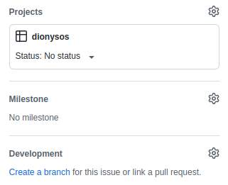

# Dionysos client
Share and watch movies with your friends.

# Dev

## Project setup

### 1. NodeJS
The best way to get NodeJS is with [nvm](https://github.com/nvm-sh/nvm) or [nvm for Windows](https://github.com/coreybutler/nvm-windows).  
The NodeJS version used for the project is the `16.15.1`  

### 2. Packet manager
Pnpm is used as the packet manager for it’s speed and space efficiency while remaining compatible with Tauri.  
`npm install -g pnpm`  

### 3. Tauri
You need to install Rust and some dependencies.  
You can check os dependent installation [here](https://tauri.studio/v1/guides/getting-started/prerequisites/).

### 4. Clone and pnpm
Clone the project, go into it and install the Javascript dependencies.
```
git clone git@github.com:Brawdunoir/dionysos-client.git  
cd dionysos-client  
pnpm i
```

## Commands

### Dev
You can now run the app with hot-reloading.  
`pnpm tauri dev`

### Build
Create a bundle located at `src-tauri/target/release`  
`pnpm tauri build`

### Test
Run tests in watch mode  
`pnpm test`  

Run tests once  
`pnpm test:run`

Run tests coverage  
`pnpm coverage`

## Intern dev workflow
If you never used github as a project manager, here is how we work on the project.  

- In the `Issues` tab, either
	- Create an issue about a change you want to make, add the revelent tags about it and add it to the project.  
	- Pick an existing issue.  

	Assign yourself, talk about the issue if needed.  


- Once created, set the status of the project to "Todo" and create a branch to work on it. For that just clic on `create a branch`, let the default settings, create and checkout localy.   



- Once your work done, go back in the `Code` tab and create a `Pull Request` with the notification about your branch being ahead of `main`. You'll need a reviewer for your code to get squashed and merged.
